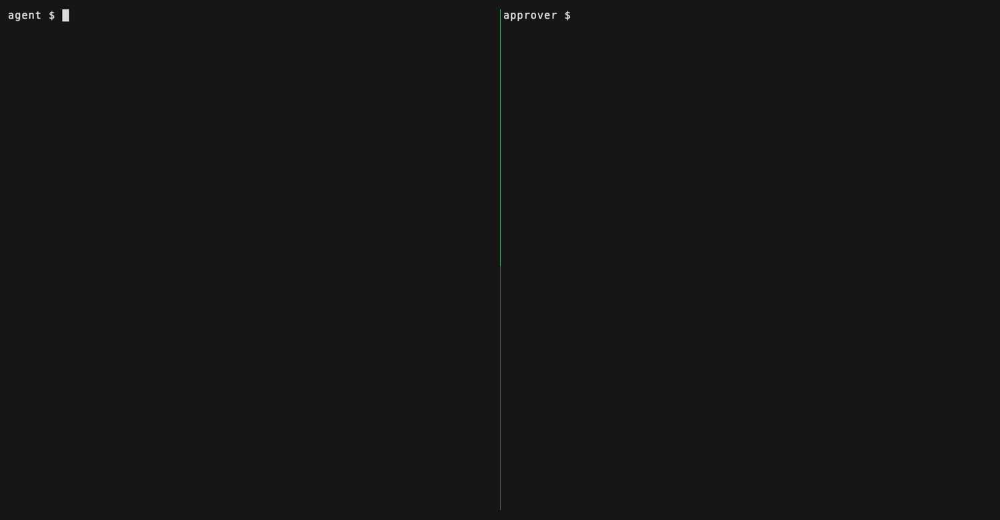

# permitd

**Governed tool execution for agent loops.**



Your agent loop wants to send the email, write the file, hit the API. You want
a human decision in between — one that an agent cannot fake, replay, or bend
to different arguments — and a line in an audit log either way.

```
propose(tool, args) ──> permit (signed, TTL, single-use)
                   ──> approve   (a human, out-of-band: CLI, or any callable)
                   ──> execute   (verify + burn, atomically)
                   ──> one audit line lands (append-only JSONL)
```

permitd is that flow as a small, stdlib-only Python library. It is also
**loop state**: the permit lives in SQLite, so a call proposed in turn N of
your agent loop is approved from another terminal and executed in turn N+K —
across restarts, across processes.

Every non-execute outcome is fail-closed. A missing, expired, denied,
tampered, argument-mismatched, or already-used permit is refused, and the
refusal is audited too.

## Install

```
pip install permitd
```

Python ≥ 3.10, zero dependencies.

## Sixty seconds, two terminals

**Terminal 1 — the agent side** (`agent.py`):

```python
import time
from permitd import Gate, RED

gate = Gate(db="permitd.db")

@gate.tool(tier=RED, description="send a message to someone")
def send_message(to, body):
    return f"delivered to {to}: {body!r}"

args = {"to": "alice", "body": "hello from the loop"}
r = gate.call("send_message", args)
print(r.error)                       # "... permit PRM-xxxx is proposed ..."

pid = r.permit["id"]
while gate.get(pid).status == "proposed":   # this state survives restarts
    time.sleep(1)

r = gate.call("send_message", args, permit_id=pid)
print(r.result if r.ok else r.error)
```

```
python agent.py
```

**Terminal 2 — the human side:**

```
$ permitd pending
1 pending permit(s):
  PRM-3f9c21ab44de  [proposed]  send_message
      args: {"to": "alice", "body": "hello from the loop"}
      proposed: 2026-07-29T18:12:03+00:00  ttl: 300s

$ permitd approve PRM-3f9c21ab44de
approved — PRM-3f9c21ab44de is executable for 300s, single use, bound to exactly these arguments
```

Terminal 1 wakes up and prints `delivered to alice: 'hello from the loop'`.
The trail:

```
$ permitd audit
{"ts": "...", "event": "proposed", "permit_id": "PRM-3f9c21ab44de", "tool": "send_message", ...}
{"ts": "...", "event": "approved", "permit_id": "PRM-3f9c21ab44de", ...}
{"ts": "...", "event": "executed", "permit_id": "PRM-3f9c21ab44de", "ok": true}
```

That is the whole product: propose, approve, execute, audit line.

## What the permit actually guarantees

- **Bound to exact arguments.** A permit is scoped to
  `sha256(tool + canonical_json(args))`. Approval for "send X to Alice" cannot
  be replayed as "send Y to Eve" — key order and whitespace don't change the
  binding; any value change does (`args_mismatch`).
- **Single-use, atomically.** The burn is one SQLite compare-and-swap
  (`UPDATE ... WHERE status='approved'`), so two processes racing the same
  permit cannot both pass (`already_used`).
- **Time-boxed twice.** A proposal is approvable for `ttl_seconds` (default
  300); a minted approval is executable for another `ttl_seconds`. Unparseable
  timestamps count as expired.
- **HMAC-signed.** Approval mints
  `HMAC-SHA256(secret, id.binding_hash.approved_at)`, re-verified at execute
  time — a store row edited behind the kernel's back fails (`bad_signature`).
- **Fail-closed everywhere.** Anything the kernel cannot positively verify —
  including "the arguments could not even be inspected" — is a refusal, not a
  pass. Refusals are audited with their reason.

## Tiers

`Gate` is a small registry with three tiers over the kernel:

| tier | meaning | gate |
|---|---|---|
| `GREEN` | read-only over your own state | runs freely, audited |
| `YELLOW` | external read (search, fetch) | one standing toggle: `gate.standing_authorization = True` |
| `RED` | write / exec / send | per-call permit: the flow above |

If you don't want the registry, use the kernel directly:

```python
from permitd import PermitKernel, SqliteStore, AuditLog

kernel = PermitKernel(SqliteStore("permitd.db"),
                      secret_path="permitd.db.secret",
                      audit=AuditLog("permitd_audit.jsonl"))
p = kernel.propose("deploy", {"target": "prod"})
kernel.approve(p.id)                      # or from the CLI / your own UI
kernel.execute("deploy", {"target": "prod"}, p.id, runner=do_deploy)
```

`approve` is just a method on a store-backed kernel — call it from a CLI, a
Slack handler, an HTTP endpoint, wherever your human is.

## The egress guard

Before any non-GREEN call runs — **including at propose time** — its arguments
are scanned for credential-shaped content: private-key blocks, `Bearer`/`Basic`
headers, AWS/GitHub/Slack/Stripe/OpenAI/Anthropic/Google key shapes, inline
`api_key=...` assignments, the values of this process's own sensitive
environment variables, and a conservative high-entropy backstop. A poisoned
context that steers a secret into a tool argument is refused before anything
leaves, before any approval card is shown, and the refusal reason names the
matched *shape*, never the value.

## MCP: gate any agent's tools, including Claude Code's

[`examples/mcp_server/`](examples/mcp_server/) is an MCP server whose tools go
through the gate. Point any MCP-speaking agent at it and that agent gets
propose → approve → execute + audit with **zero agent-side changes**: the
agent calls a RED tool, is told "permit PRM-… proposed, waiting for approval",
you run `permitd approve PRM-…` in another terminal, the agent retries and the
call executes. The audit line lands either way.

## Storage

`SqliteStore` (default, durable, atomic burn) and `MemoryStore` (tests,
ephemeral) ship in the box. Anything else needs five methods — see the
`PermitStore` protocol in [`store.py`](src/permitd/store.py); keep `burn`
compare-and-swap or you lose the one-shot guarantee. The audit trail is a
separate append-only JSONL file so it stays `tail -f`-able.

## What permitd is not

Not an agent, not a framework, not memory, not RAG. It has no opinion about
your loop, your model, or your prompts. It is the layer that holds the state
of "may this run?" across turns — and the receipt after it did.

## Ancestry

Extracted from the tool-governance kernel of
[brainfoundry-nous](https://github.com/hbar-systems/brainfoundry-nous), where
it runs in production gating a personal AI node's tools. The
propose/confirm/execute + audit grammar goes back to
[hbar.brain.console](https://github.com/hbar-systems/hbar.brain.console)
(2026-03). Design notes: [DESIGN.md](DESIGN.md).

## License

MIT.
